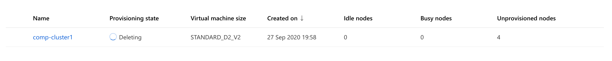

# Optimizing an ML Pipeline in Azure

## Overview
In this project, we build and optimize an Azure ML pipeline using the Python SDK and a provided Scikit-learn model.
This model is then compared to an Azure AutoML run.

## Summary
In 1-2 sentences, explain the problem statement: e.g "This dataset contains data about... we seek to predict..." 
**Answer: This Dataset contains the data about the marketing campaign of a Potuguese banking institution.We seek to predict whether the client has subscibed to the term deposit or not.**

In 1-2 sentences, explain the solution: e.g. "The best performing model was a ..." 
**Answer: The best performing model was MaxAbsScaler LightGBM and Voting  Enseble both of which achieved a weighted AUC score of 0.9489.**

## Scikit-learn Pipeline
Explain the pipeline architecture, including data, hyperparameter tuning, and classification algorithm. 
**Answer: The pipline architecture is as follows :**
- **The Scikit pipeline had a seperate script train.py which contains several functions.Initially the Dataset is read from a URL using the TabularDatasetFactory.The data has records of the various clients in marketing campaign and our goal is to predict the variable "y"**.
- **The data is cleaned and processed to make sure it is ML ready and LogisticRegression is chosen as the model.Categorical features are converted to numeric values. The evaluation metric is chosen as Weighted AUC as the data is highly imbalanced.LogisticRegression classifer applies a sigmoid function to the summation of the products of the weights and features and outputs probabilities.**
- **A compute cluster is initialized and an estimator is created.**
- **A paramter sampler with various set of hyperparameters and a stopping policy is defined.**
- **A hyperdrive config is created with the estimator, parameter sampler and policy and maximum number of runs is specified. The primary metric is AUC and the goal is to maximize this metric.**
- **Finally, we submit the experiment and visualiza the results using widget**. 

**What are the benefits of the parameter sampler you chose?**
**Answer: The parameter sampler that is selected in the *RandomparameterSampler*. This sampler selects random parameters over a defined range. This saves time and computation resources are  all the possible combinations are not tried.Only a subset of these parameters are tried at random.**

**What are the benefits of the early stopping policy you chose?**<br?
**Answer: The stopping policy chosen is the *BanditPolicy*. It terminates the run which are unsatisfactory and are not within the slack range of the best performing run.**

## AutoML
In 1-2 sentences, describe the model and hyperparameters generated by AutoML. 
**Answer: AutoML tried series of algorithms and the best one that was chosen was Voting Ensemble Classifier.The various algorithms used as a part of this ensemble were LightGBM, XgBoost and SGDClassifier.** 
 
**LightGBM is a tree based boosting algorithm.However it has several advantages over Gradient Boosted Trees. It can be trained in a distributed fashion which results in higher efficieny and lower training time. LightGBM also delivers better accuracy.The various hyperparameters that were generated by AutoML for LightGBM were :** 
- boosting_type='gbdt'
- colsample_bytree=1.0
- importance_type='split'
- learning_rate=0.1
- max_depth=-1
- min_child_samples=20,
- min_child_weight=0.001
- min_split_gain=0.0,
- n_estimators=100
- n_jobs=1
- num_leaves=31,
- reg_alpha=0.0
- reg_lambda=0.0
- silent=True,
- subsample=1.0
- subsample_for_bin=200000
- subsample_freq=0 

**XGBoost is an optimized distributed gradient boosting library designed to be highly efficient. It implements machine learning algorithms under the Gradient Boosting framework. XGBoost provides a parallel tree boosting that solve many data science problems in a fast and accurate way.The various hyperparameters are:**
- base_score=0.5
- booster='gbtree'
- colsample_bylevel=1
- colsample_bynode=1
- colsample_bytree=1 
- gamma=0
- learning_rate=0.1 
- max_delta_step=0
- max_depth=3
- min_child_weight=1
- n_estimators=100, n_jobs=1
- reg_alpha=0
- reg_lambda=1
- scale_pos_weight=1
- subsample=1
- tree_method='auto'
- verbose=-10 

**Similarly SGDclassifier implement regularized models and use Stochastic Gradient approach to learn the hyperparameters.**

## Pipeline comparison
Compare the two models and their performance. What are the differences in accuracy? In architecture? If there was a difference, why do you think there was one? 
**Answer: For the sklearn pipeline using Hyperdrive the LogisticRegression Model achieved an *Accuracy of 91.4%* and *weighted AUC score of 0.927*. 
On the other hand The VotingEnsemble Classifier achieved an *Accuracy of 91.5%* and *weighted AUC score of 0.95* which is Amazing. 
The VotingEnsemble Classifier optimized by AutoML outperforms LogisticRegression.Logistic Regressionis a linear model which has a softmax activation to output class probabilities.On the other hand Voting Ensemble consists of several algorithms like LightGBM, XgBoost whicg are tree based models are are more robust and efficient. Also Voting tend to reduce bias associated with model and helps the model generalize better.**

## Future work
What are some areas of improvement for future experiments? Why might these improvements help the model? 
**Answer: There is a huge scope for future improvements. The first and the foremost option will be to collect more data. A good and a huge dataset will help the model to capture more patterns. It is also important to have a balanced dataset or the model tend to get biased towards the majority class.If the balance cannot be maintained there can be several techniques used to balance the data like SMOTE and ADASYN which generate synthetic data to match the class distribution.Also we can try more range of hyperparameters for Hyperdrive and  increase the experiment timeout for AutoML which will try more combinations of different models and hyperparameters which will help with a better and more accurate model.**

## Proof of cluster clean up
**If you did not delete your compute cluster in the code, please complete this section. Otherwise, delete this section.**
**Image of cluster marked for deletion** 
**Answer: I am deleting the compute cluster in the code itself.**

